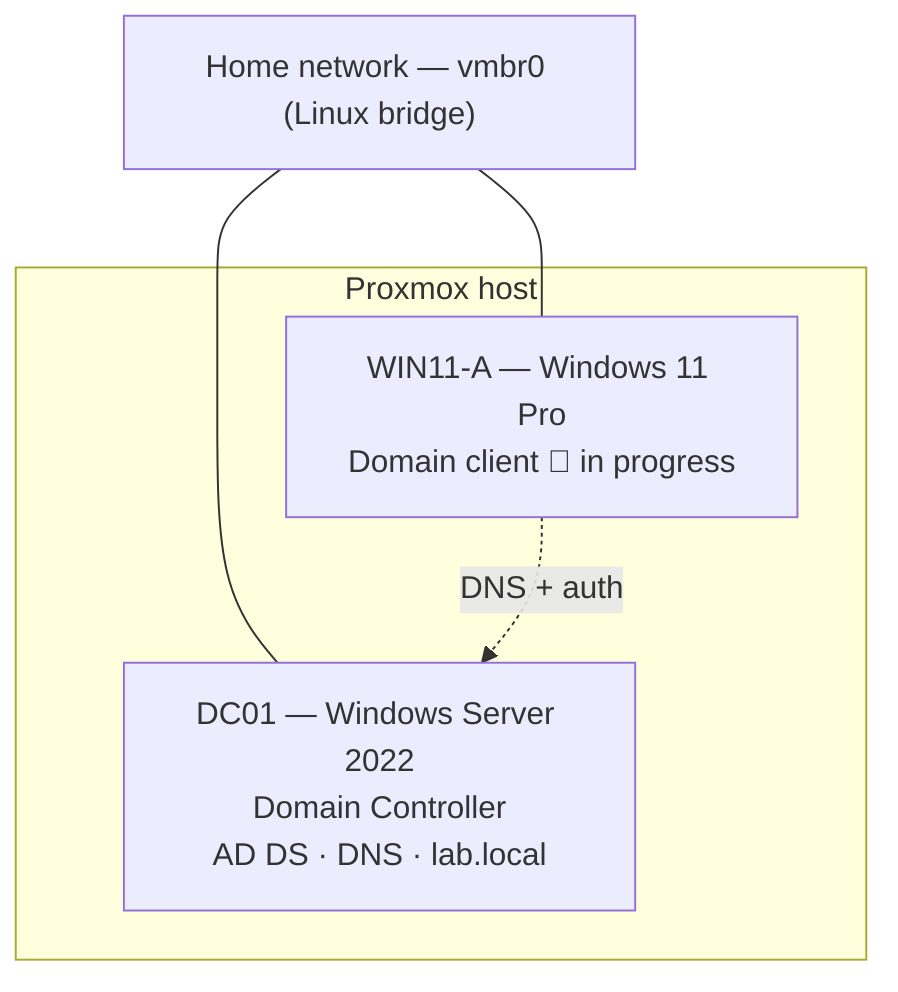

# Active Directory Home Lab — Windows Server 2022 Domain Controller on Proxmox

> **Status:** 🚧 Work in progress — core domain controller is live and verified; first client is mid-build.

A self-hosted Active Directory lab built on a Proxmox homelab. The goal is hands-on
experience with enterprise identity infrastructure — standing up a domain controller,
running DNS, managing users/groups/OUs, and joining client machines to the domain — in a
safe, self-contained environment.

This project is part of a broader homelab and self-hosting learning track (previously:
WireGuard VPN, Vaultwarden, Proxmox tuning).

---

## Why this project

Active Directory is the identity backbone of the majority of enterprise networks, which
makes it foundational for sysadmin work and one of the most common attack surfaces in
security. Building one end-to-end — rather than reading about it — means understanding how
authentication, DNS, and policy actually fit together.

**Skills demonstrated:**
- Virtualization on Proxmox (VM provisioning, hardware config, networking)
- Windows Server 2022 installation and base configuration
- Active Directory Domain Services (AD DS) deployment
- DNS fundamentals (self-referencing DNS, forest DNS zones)
- Directory administration (OUs, users, groups)
- Static IP addressing and network design decisions
- Documentation and reproducibility

---

## Architecture



**Design decisions:**

| Decision | Choice | Reasoning |
|---|---|---|
| Network isolation | Shared `vmbr0`, **no DHCP role** | Static IPs mean no DHCP server to conflict with the home router. Isolated `vmbr1` + NAT is a planned later step, only needed for DHCP testing. |
| Addressing | Static IPs | A domain controller must have a fixed address so clients can reliably resolve it. |
| Domain name | `lab.local` | Self-contained, no external dependencies. `.local` is fine for a lab (production would use an owned subdomain like `ad.example.com` to avoid mDNS edge cases). |
| Client edition | Windows 11 **Pro** | Home edition cannot join a domain. |

---

## Environment

### Proxmox host
- Proxmox VE, Intel business workstation (4-core, Haswell-era), enterprise SSD storage.

### DC01 — Domain Controller VM

| Setting | Value |
|---|---|
| OS | Windows Server 2022 Standard (Desktop Experience), 180-day eval |
| Machine / BIOS | i440fx / SeaBIOS |
| Disk | 60 GB, **SATA** bus (no driver needed at install) |
| CPU | 2 cores, type `host` |
| Memory | 5 GB (4 GB minimum; 5 GB comfortable) |
| Network | `vmbr0`, Intel E1000 model |
| QEMU Agent | Enabled (channel only; guest agent install pending) |

### WIN11-A — Client VM (in progress)

| Setting | Value |
|---|---|
| OS | Windows 11 Pro (unactivated — "I don't have a product key") |
| Machine / BIOS | q35 / OVMF (UEFI) + EFI disk |
| Security | TPM 2.0 device, Secure Boot |
| Disk | 64 GB, SATA bus |
| CPU | 2 cores, type `host` |
| Memory | 4 GB |
| Network | `vmbr0`, Intel E1000 model |

> **Note:** All passwords and real IP addresses in this document are redacted or shown as
> examples. IPs below use an illustrative `192.168.1.0/24` scheme.

---

## Build log

### 1. Create the domain controller VM
Provisioned `DC01` in Proxmox with the specs above. Chose SATA over VirtIO for the disk so
Windows detects it during install without loading paravirtualized drivers, and CPU type
`host` for full performance and feature pass-through.


### 2. Install Windows Server 2022
Booted from the eval ISO, selected **Standard (Desktop Experience)** for the full GUI,
performed a custom install to the 60 GB disk, and set the local Administrator password.


### 3. Base OS configuration
- Set network profile to **Private** (discoverable) so AD network services aren't blocked.
- Renamed the computer to `DC01` and rebooted.
- Assigned a **static IP** with **DNS pointing at the server's own address** — this is
  mandatory for AD, since the DC becomes its own DNS server.

```
IP address:        192.168.1.10   (example)
Subnet mask:       255.255.255.0
Default gateway:   192.168.1.1    (router)
Preferred DNS:     192.168.1.10   (itself)
```


### 4. Install AD DS and promote to domain controller
- Installed the **Active Directory Domain Services** role via Server Manager.
- Promoted the server, creating a **new forest**: `lab.local`.
- Kept the **DNS server** option checked; set the **DSRM** (Directory Services Restore Mode)
  recovery password.
- Skipped DNS delegation (expected for a standalone forest with no parent zone).
- Functional level left at default (Windows Server 2016 is the highest available on 2022).

The server rebooted and now presents logins as `LAB\Administrator` — confirming the domain
is live.


### 5. Verify the deployment
Ran health checks after promotion:

```powershell
dcdiag
nltest /dsgetdc:lab.local
```

`dcdiag` passed its checks — the DC is healthy. Server Manager now shows the **AD DS** and
**DNS** roles, and the full AD toolset (ADUC, Group Policy Management, DNS) is available
under **Tools**.


### 6. Populate the directory
Using **Active Directory Users and Computers (ADUC)**:
- Created an Organizational Unit: **`Lab Users`**
- Created a user: **`testuser`** (Test User) with a non-expiring lab password
- Created a security group: **`Lab Team`** and added `testuser` as a member


### 7. Build the first client — *in progress*
Provisioned `WIN11-A` (Windows 11 Pro) with UEFI + Secure Boot + TPM 2.0. Currently at
Windows out-of-box setup, bypassing the Microsoft-account requirement to create a **local
account** (a domain client should join on-prem AD after install, not sign into Azure AD).

---

## Concepts / notes to self

Things worth remembering from this build:

- **Static IP + self-referencing DNS on the DC is non-negotiable.** Clients find the domain
  by asking the DC for DNS; if that address moves, the domain breaks.
- **DHCP is the real home-network footgun**, not DNS. A DC with the DHCP role competes with
  the home router's DHCP. Avoided entirely here by using static IPs.
- **SATA vs VirtIO vs IDE:** SATA is the sweet spot for a Windows VM — modern and driver-free
  at install. VirtIO is faster but needs a driver loaded during setup.
- **CPU type `host`** passes the physical CPU's features through — needed for the Windows 11
  compatibility check, and gives full performance.
- **DSRM password** is a separate break-glass recovery credential, distinct from the admin
  login. Reused here for lab simplicity; production keeps them different.
- **Windows edition matters:** only Pro / Enterprise / Education can join a domain.
- **Trust the guest's Task Manager over the Proxmox memory graph** — Windows caches unused
  RAM, so the hypervisor graph reads high even when the OS is barely using memory
  (confirmed at ~26% actual usage while the graph looked maxed).

---

## Roadmap

- [x] Deploy Windows Server 2022 domain controller (`lab.local`)
- [x] Verify with `dcdiag`
- [x] Create OU, user, and group
- [ ] Finish Windows 11 client install (local account)
- [ ] Set client static IP with DNS pointed at the DC
- [ ] **Join `WIN11-A` to the domain** and log in as `LAB\testuser`
- [ ] Clone `WIN11-A` → `WIN11-B` (second client)
- [ ] Group Policy experiments (password policy, drive mapping, desktop lockdown)
- [ ] PowerShell administration (`New-ADUser`, bulk object creation)
- [ ] Isolated `vmbr1` + NAT bridge for **DHCP** testing
- [ ] Install QEMU guest agent from virtio-win ISO
- [ ] (Stretch) AD security exploration in the isolated segment

---

## Credentials

All lab credentials (Administrator, DSRM, domain user) are kept in a local notes file and
are **not** committed to this repository. Placeholders are used throughout this document.
